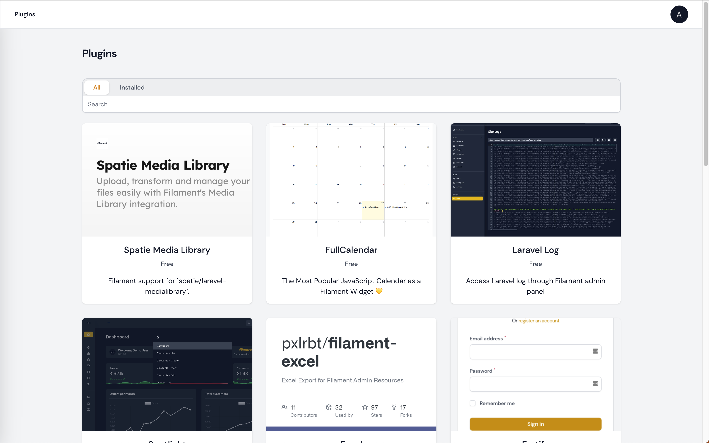

# Add a page to your Filament panel to search for plugins.

[](https://packagist.org/packages/ryangjchandler/filament-plugin-search)
[](https://github.com/ryangjchandler/filament-plugin-search/actions?query=workflow%3Arun-tests+branch%3Amain)
[](https://github.com/ryangjchandler/filament-plugin-search/actions?query=workflow%3A"Check+%26+fix+styling"+branch%3Amain)
[](https://packagist.org/packages/ryangjchandler/filament-plugin-search)

This package provides a simple page that lets you search for Filament plugins directly inside of your admin panel.



## Installation

You can install the package via Composer:

```bash
composer require ryangjchandler/filament-plugin-search
```

## Usage

The page is automatically registered with Filament.

## Testing

```bash
composer test
```

## Changelog

Please see [CHANGELOG](CHANGELOG.md) for more information on what has changed recently.

## Contributing

Please see [CONTRIBUTING](.github/CONTRIBUTING.md) for details.

## Security Vulnerabilities

Please review [our security policy](../../security/policy) on how to report security vulnerabilities.

## Credits

- [Ryan Chandler](https://github.com/ryangjchandler)
- [All Contributors](../../contributors)

## License

The MIT License (MIT). Please see [License File](LICENSE.md) for more information.
